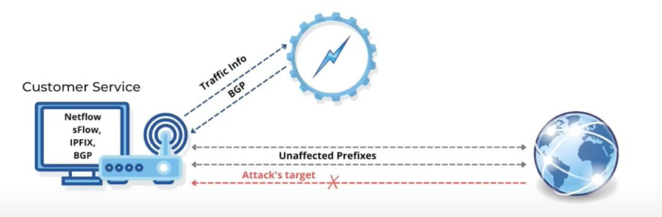
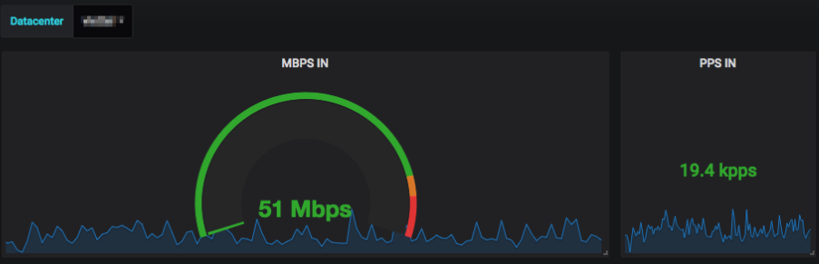

## Defending Against DDoS Attacks Using FastNetMon: A Comprehensive Guide

DDoS (Distributed Denial of Service) attacks are common threats faced by high-speed networks, aiming to overload infrastructure and thereby disrupting services. If you're operating a network at speeds greater than 10 Gbps and are under DDoS attacks, FastNetMon can be a useful tool to detect and mitigate these threats.

### Common Types of DDoS Attacks:

1. **Volume-Based Attacks**: Overwhelm bandwidth with a vast amount of data. Examples include UDP Floods, ICMP Floods.
2. **Protocol Attacks**: Exploiting vulnerabilities in server resources. Examples include SYN Flood, Ping of Death.
3. **Application Layer Attacks**: Target specific application vulnerabilities. Examples include Slowloris, HTTP POST/GET flood.

Certainly! Utilizing traffic flow (e.g., NetFlow, sFlow, IPFIX) can offer a more scalable way to monitor traffic for DDoS detection. Here's the modification to the guide with a preference for traffic flow:

### Setting Up FastNetMon:

#### 1. **Dedicated Server**:
FastNetMon should be installed on its dedicated server. The server must have enough processing power and RAM to analyze traffic at the rate at which it's incoming.



#### 2. **Installation**:
Install FastNetMon using the package manager of your operating system or by compiling from source.

```bash
sudo apt update
sudo apt install fastnetmon
```

#### 3. **Router/Switch Configuration for Traffic Flow**:

You need to configure your router or switch to send traffic flow data (like NetFlow or sFlow) to the FastNetMon server.

For a **Cisco** router, to configure NetFlow:

```bash
interface GigabitEthernet0/1
 ip flow ingress
 ip flow egress

ip flow-export source GigabitEthernet0/1
ip flow-export version 9
ip flow-export destination [FastNetMon_Server_IP] 2055
```

For switches that support **sFlow**, a sample configuration might look like:

```bash
sflow 1 destination [FastNetMon_Server_IP] 6343
sflow 1 sampling all 1 out of 400
sflow 1 polling all 20
sflow 1 enable
```

*Note: Adjust the sample rate as appropriate for your traffic volume.*

#### 4. **FastNetMon Configuration**:

Navigate to FastNetMon's configuration directory:

```bash
cd /etc/fastnetmon/
```

Open the configuration file:

```bash
sudo nano fastnetmon.conf
```

Set these essential configurations:

- **networks_list**: Add all your network subnets in CIDR notation.
- **interfaces**: Your NICs' names where FastNetMon should capture traffic.
- **average_calculation_time**: Set the average calculation time.
- **ban_time**: Decide how long an IP should be banned.
- **threshold_mbps**: Set the threshold (in Mbps) beyond which you consider traffic as an attack.

If using **NetFlow**:

```
listen_netflow = [FastNetMon_Server_IP]:2055
```

If using **sFlow**:

```
listen_sflow = [FastNetMon_Server_IP]:6343
```

Example configuration:

```
networks_list = 10.0.0.0/24
interfaces = eth0
average_calculation_time = 10
ban_time = 300
threshold_mbps = 5000
listen_sflow = 0.0.0.0:6343
```

#### 5. **Notification and Integration**:

FastNetMon can notify administrators about attacks through emails, Slack, or by integrating with tools like Grafana. Ensure to configure these settings as per your requirements.

#### 6. **Start FastNetMon**:

Once configured, start the service:

```bash
sudo service fastnetmon start
```

#### 7. **Monitoring and Reporting**:

Periodically check FastNetMon's statistics to monitor the traffic and potential threats:

```bash
fastnetmon_client
```

This command displays real-time data about incoming/outgoing packets and potential attacks.


## Traffig capturing for other routers

### **Huawei NetFlow Setup**:

1. **Enter system view**:
   ```
   system-view
   ```

2. **Define a NetStream flow exporter**:
   ```
   ip netstream export version 9
   ```

3. **Specify the export destination**:
   ```
   ip netstream export host [FastNetMon_Server_IP] 2055
   ```

4. **Enter interface view for the desired interface**:
   ```
   interface GigabitEthernet0/0/1
   ```

5. **Enable ingress NetStream on the interface**:
   ```
   ip netstream inbound
   ```

6. **Exit and saave system view**:
   ```
   quit
   save
   ```

### **MikroTik Router Setup**:

1. **Enable IP traffic flow**:
   ```
   /ip traffic-flow
   set enabled=yes
   ```

2. **Set interfaces on which to monitor traffic**:
   ```
   /ip traffic-flow target add interface=all dst-address=[FastNetMon_Server_IP] port=2055 version=9
   ```

3. **Specify the active flow timeout (optional)**:
   ```
   /ip traffic-flow
   set active-flow-timeout=1m
   ```

4. **Specify the inactive flow timeout (optional)**:
   ```
   /ip traffic-flow
   set inactive-flow-timeout=15s
   ```

### **MikroTik WebFig/WinBox Setup for Traffic Flow**:

   
1. **Traffic Flow Settings**:
   - Navigate to `IP` and then select `Traffic Flow`.
   - Click on the `Settings` tab or button.
   - Enable traffic flow by checking or setting the `Enabled` option.
   - (Optional) Adjust the `Active Flow Timeout` and `Inactive Flow Timeout` settings if needed. The default usually works for most cases.

2. **Specify the Target**:
   - Under the `Targets` tab or section, click on `Add New` or the `+` button to add a new target.
   - Set the `Interface` to the one you wish to monitor (or `all` to monitor all interfaces).
   - In the `IP Address` field, enter the IP address of your FastNetMon server.
   - Set the `Port` to `2055` or your desired port.
   - Set the `Version` to `9` for NetFlow version 9.
   - Apply the changes and save/close.

3. **Apply & Save**:
   - Depending on the interface, apply the changes and/or save your configuration to ensure the router retains the settings after a reboot.


### Installing Grafana (UI Dashboard for FasstNetMon):



#### 1. **Add Grafana Repository and Install**:

If you're on an Ubuntu/Debian system:

```bash
sudo apt-get install -y software-properties-common
sudo add-apt-repository "deb https://packages.grafana.com/oss/deb stable main"
wget -q -O - https://packages.grafana.com/gpg.key | sudo apt-key add -
sudo apt-get update
sudo apt-get install grafana
```

For RedHat/CentOS:

```bash
sudo yum install -y https://packages.grafana.com/oss/rpm/grafana-latest-1.x86_64.rpm
sudo yum install grafana
```

#### 2. **Enable and Start Grafana Service**:

```bash
sudo systemctl enable grafana-server
sudo systemctl start grafana-server
```

#### 3. **Access Grafana Web UI**:

By default, Grafana will be available at `http://your_server_ip:3000/`. The default login credentials are:

```
Username: admin
Password: admin
```

Make sure to change the default password after your first login.

### Integrating FastNetMon with Grafana:

FastNetMon can push its metrics to Graphite, which Grafana can then use as a data source.

#### 1. **Configure FastNetMon to Send Metrics to Graphite**:

Edit FastNetMon's configuration:

```bash
sudo nano /etc/fastnetmon/fastnetmon.conf
```

Enable and configure the Graphite integration:

```
graphite = on
graphite_host = 127.0.0.1
graphite_port = 2003
graphite_prefix = fastnetmon
```

Restart FastNetMon to apply changes:

```bash
sudo service fastnetmon restart
```

#### 2. **Install and Configure Graphite**:

Depending on your OS, follow the appropriate guide to install Graphite. Once installed, ensure Graphite is running and collecting data.

#### 3. **Add Graphite as a Data Source in Grafana**:

- Login to your Grafana dashboard.
- Click on the gear (⚙️) icon on the left panel and select "Data Sources."
- Click "Add data source" and choose "Graphite."
- Fill in the URL of your Graphite instance, usually `http://localhost:80`.
- Save and test.

#### 4. **Import FastNetMon Dashboard**:

The Grafana community often shares custom dashboards. Look for a FastNetMon dashboard on [Grafana's dashboards site](https://grafana.com/grafana/dashboards/). Once you find one:

- Note its dashboard ID.
- In your Grafana, click on the `+` sign on the left panel and select "Import."
- Enter the dashboard ID and load the dashboard.
- Select the Graphite data source you just configured.